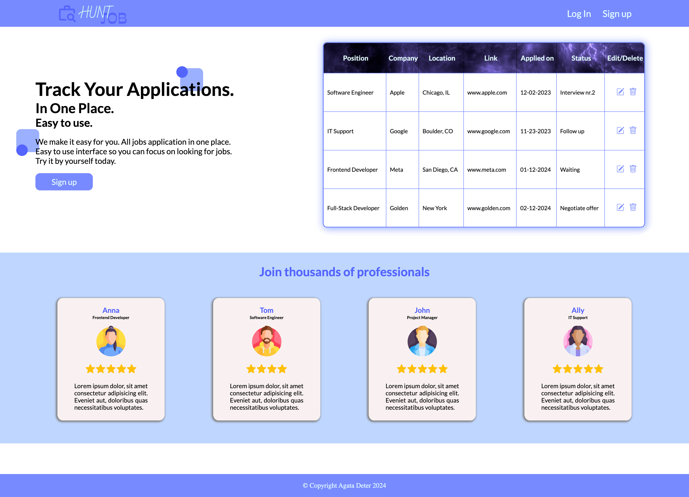
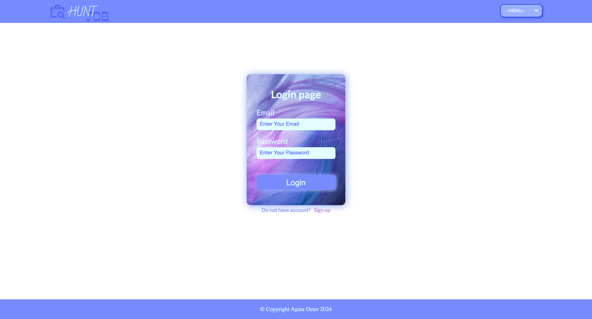
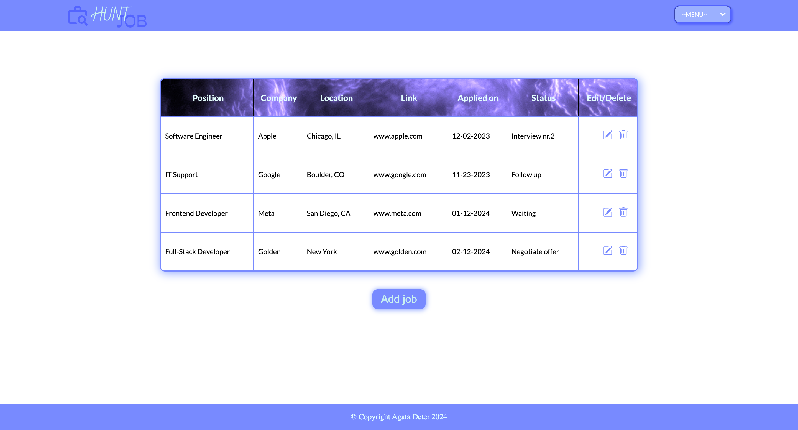

# Job-Hunt-Tracker

## Table of Contents

- [About](#about)
- [Technologies](#technologies)
- [Future app possibilities](#possibilities)
- [Screenshots](#screenshots)
- [Repo link](#repo-link)

## About

Tha webisite is the task from Software Engineering Bootcamp.
 
The requirements were to create minimum 3 pages website and practice HTML and CSS.
 
The app has main page, user can either go to login or sign up.
 
On the login/sign up page user is able to pick menu from dropdown:

1. Home page
2. All jobs board
3. Wishlist board
4. Login page
5. Sign up page

 
I was using `FLEXBOX` for layout following `responsive design` practices. 
I added gif as background in table head and image as background of forms. 
What I learned: using `animation` to fade in objects and to slide in. 

## Technologies

- HTML
- CSS

## Future app possibilities

There are possibilities to expand app for more features like:

1. Refactoring to React
2. Or using webpack to bundle files
3. Add functionality with JavaScript/TypeScript
4. Change dropdown menu to the navigation list
5. Add page where user can pick wishlist board/ previous applications board/ all applications board

## Screenshots

1. Home page:
    
   

2. Login page:
    
   

3. All applications board:
    
   

## Repo link

https://github.com/Agata10/Job-Hunt-Tracker
